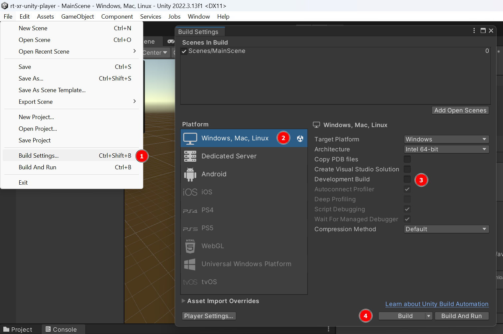
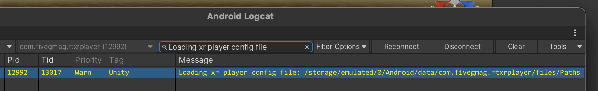
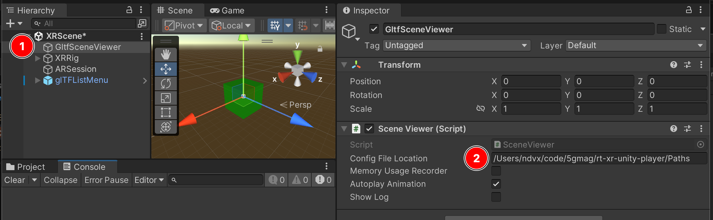
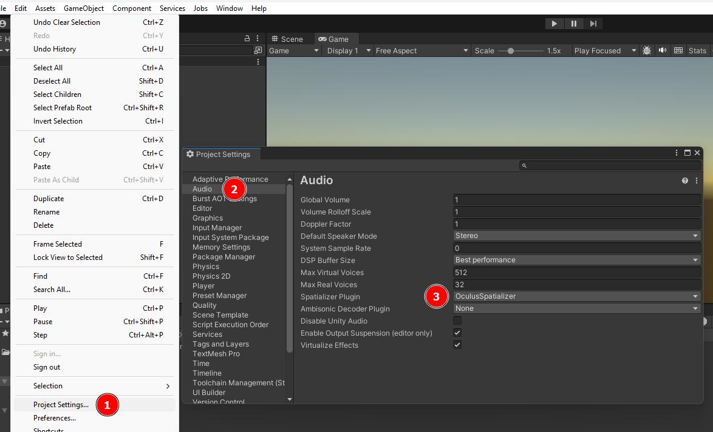

<h1 align="center">XR Unity Player</h1>
<p align="center">
  
  
  
</p>

## Introduction

The XR Unity Player is an interactive and XR-capable glTF scene viewer supporting glTF extensions specified in the MPEG-I Scene Description framework ([ISO/IEC 23090-14](https://www.iso.org/standard/86439.html)), implemented in Unity3D. These extensions support features such as video textures, spatial audio sources, interactivity behaviors, AR anchors, ...

Additional information can be found at: https://5g-mag.github.io/Getting-Started/pages/xr-media-integration-in-5g/

### Supported Unity Editor version

The project supports the [Unity3D 2022 LTS editor release](https://unity.com/releases/editor/qa/lts-releases).


### Supported platforms

It is currently developped and tested on Android devices.
If you are interested in supporting other platforms, please contact the 5GMAG working group.


## Downloading

The project has dependencies which are not delivered through UPM (Unity's Package Manager), but instead are tracked as git submodules.

**clone the project and fetch all submodules**
```
mkdir gltfsceneviewer && cd gltfsceneviewer
git clone https://github.com/5G-MAG/rt-xr-unity-player.git .
git submodule update --init --recursive
```

**update all submodules**
```
git submodule update --recursive
```

## working wwith the submodule dependencies

The project has dependencies which aren't supplied through UPM and are maintained on the 5G-MAG github organization:

- *rt-xr-glTFast*: a fork of `com.atteneder.glTFast` 
- *rt-xr-maf-native*: C++ media pipelines

> [!IMPORTANT] 
> **Refer to [this documentation](docs/rt-xr-dependencies)** if you are contributing to these dependencies.

## Building

### Building the Unity project


1. Locate the `Build Settings` menu
2. Review that Android is the selected platform, [change as needed](#changing-the-build-target-platform)
3. Review the build type
4. Build 


## Configuring the project

### Configure the main menu's list of gltf documents

When the player launches, it looks up a configuration file named 'Paths' containing a list of scenes that populates the main menu to allow selecting between scenes.

The list of scenes is a simple text file with each line providing the location of the gltf documents.
The locations can be local files or ressources available over HTTP.
A relative path is considered relative to the configuration file.

```
/path/to/rt-xr-content/awards/scene.gltf
https://127.0.0.1:8000/rt-xr-content/awards/scene.gltf
awards/scene.gltf
```

By default the application will look for this file in the platform specific [Application.persistenDataPath](https://docs.unity3d.com/ScriptReference/Application-persistentDataPath.html). 

On Android, the path would typically be: `/storage/emulated/0/Android/data/com.fivegmag.rtxrplayer/files/Paths`, which can be confirmed by [inspecting the application's log](https://docs.unity3d.com/Manual/com.unity.mobile.android-logcat.html):

.

To push the configuration file to the device, connect the android device to the workstation with a usb cable and use `adb`:
```
adb push ./Paths /storage/emulated/0/Android/data/com.fivegmag.rtxrplayer/files/Paths
```

It is also possible to define a custom location for the configuration file, by setting its path in Unity's Editor:



### Configure an Audio spatializer SDK

Support for spatial audio, Unity3D requires an Audio Spatializer has to be configured in the project settings *Edit > Project Settings > Audio > Spatializer Plugin*.



**If no audio spatializer plugin is configured, audio will play without spatialization**.

Please refer to Unity's [documentation for details and a list of available plugins](https://docs.unity3d.com/Manual/VRAudioSpatializer.html). 

Unity provides a native audio spatializer SDK with a [simple spatializer implementation](https://docs.unity3d.com/Manual/AudioSpatializerSDK.html).


## License

This project is developed under 5G-MAG's Public License. For the full license terms, please see the LICENSE file distributed along with the repository or retrieve it from [here](https://drive.google.com/file/d/1cinCiA778IErENZ3JN52VFW-1ffHpx7Z/view).

