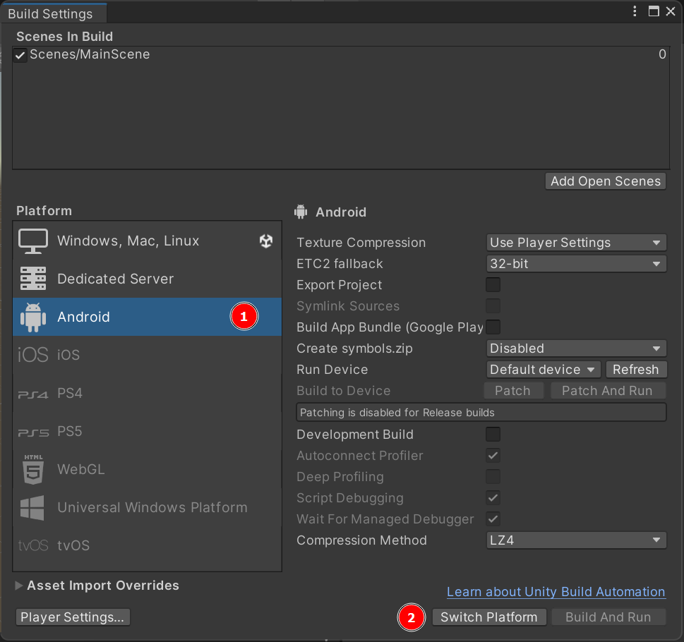
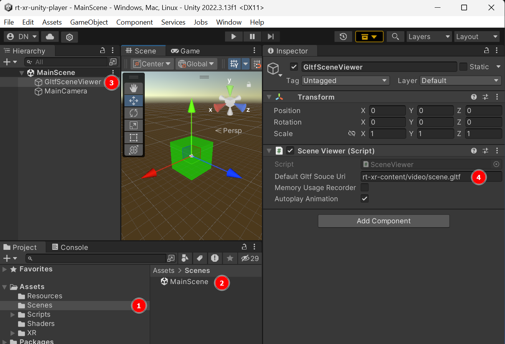

<h1 align="center">XR Unity Player</h1>
<p align="center">
  
  
  
</p>

## Introduction

The XR Unity Player is an interactive and XR-capable glTF scene viewer supporting glTF extensions specified in the MPEG-I Scene Description framework ([ISO/IEC 23090-14](https://www.iso.org/standard/86439.html)), implemented in Unity3D. These extensions support features such as video textures, spatial audio sources, interactivity behaviors, AR anchors, ...

Additional information can be found at: https://5g-mag.github.io/Getting-Started/pages/xr-media-integration-in-5g/

### About the implementation

The project supports the latest [Unity3D LTS editor release](https://unity.com/releases/editor/qa/lts-releases), Unity 2022.3.

The XR Player feature set dependends on the target platform. See the [features page](https://5g-mag.github.io/Getting-Started/pages/xr-media-integration-in-5g/features) implementation status.

It is currently developped, tested and built for Windows and Android targets.

## Downloading

The project has dependencies which are not delivered through UPM (Unity's Package Manager), but instead are tracked as git submodules.

**clone the project and fetch all submodules**
```
mkdir gltfsceneviewer && cd gltfsceneviewer
git clone https://github.com/5G-MAG/rt-xr-unity-player.git .
git submodule update --init --recursive
```

## Install dependencies

The project has dependencies which aren't supplied through UPM and are maintained on the 5GMAG github organization:

- *rt-xr-glTFast*: a fork of `com.atteneder.glTFast` 
- *rt-xr-maf-native*: C++ media pipelines

> [!IMPORTANT] 
> **Refer to [this documentation](docs/rt-xr-dependencies)** if you are contributing to these dependencies.

## Building

### Building the Unity project


1. Locate the `Build Settings` menu
2. Review the target platform, [change as needed](#changing-the-build-target-platform)
3. Review the build type
4. Build

### Changing the build target platform


1. in the build settings, select the target platform
2. click on the "switch platform" button


## Configuring the project

### Configure the default scene

The XR player allows configuration of a default scene URI, which can be overiden when running the player from the command line.  




### Configure an Audio spatializer SDK

Support for spatial audio, Unity3D requires an Audio Spatializer has to be configured in the project settings *Edit > Project Settings > Audio > Spatializer Plugin*.


**If no audio spatializer plugin is configured, audio will play without spatialization**.

Please refer to Unity's [documentation for details and a list of available plugins](https://docs.unity3d.com/Manual/VRAudioSpatializer.html). 

Unity provides a native audio spatializer SDK with a [simple spatializer implementation](https://docs.unity3d.com/Manual/AudioSpatializerSDK.html).


### Configure an XR Plugin 

https://docs.unity3d.com/Manual/xr-configure-providers.html


## Running

The player can be launched from a command line specifying a scene document to load:


If no gltf document is specified, the [default scene configured](#configure-the-default-scene) in the project is used.

### XR

If an OpenXR HMD is detected, it is used to render and control the camera.

Otherwise, the player renders in a regular desktop OS window, and camera is controled using keyboard and mouse.  

### Mouse & Keyboard controls

| Key           | Action                |
|---------------|-----------------------|
| mouse drag    | look around           |
| arrow UP      | move forward          |
| arrow DOWN    | move backward         |
| arrow LEFT    | move left             |
| arrow RIGHT   | move right            |
| mouse wheel   | move up/down          |
| left shift    | faster                |
| right shift   | faster                |
| Tab           | reset main camera     |
| L             | toggle log overlay    |

## License

This project is developed under 5G-MAG's Public License. For the full license terms, please see the LICENSE file distributed along with the repository or retrieve it from [here](https://drive.google.com/file/d/1cinCiA778IErENZ3JN52VFW-1ffHpx7Z/view).

