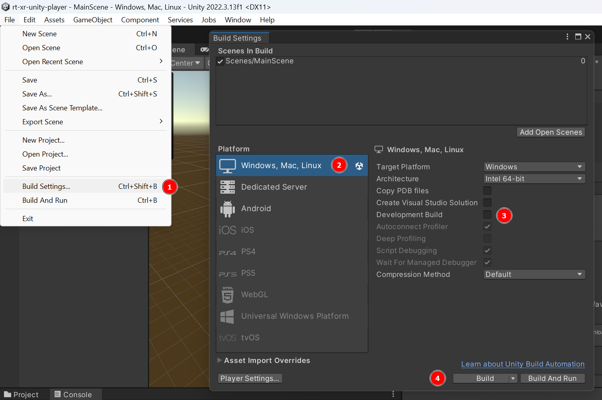

<p align="center">
  
</p>

<p align="center">
  An interactive, XR-capable glTF scene viewer built in Unity, supporting the glTF extensions of
  MPEG-I Scene Description (ISO/IEC 23090-14).
</p>

<p align="center">
  
  <a href="https://github.com/5G-MAG/rt-xr-unity-player/releases"></a>
  <a href="LICENSE"></a>
</p>

<p align="center">
  <a href="https://www.5g-mag.com/reference-tools/xr/">Project page</a> &nbsp;&middot;&nbsp;
  <a href="https://github.com/5G-MAG/rt-xr-unity-player/issues">Issues</a> &nbsp;&middot;&nbsp;
  <a href="https://www.5g-mag.com/contributing">Contributing</a>
</p>

---

## At a glance

|  |  |
|---|---|
| **Implements** | glTF extensions of MPEG-I Scene Description, [ISO/IEC 23090-14](https://www.iso.org/standard/86439.html) (the repository does not state an edition) |
| **Part of** | [XR/3D Scenes with MPEG-I Scene Description](https://www.5g-mag.com/reference-tools/xr/), alongside [rt-xr-gITFast](https://github.com/5G-MAG/rt-xr-gITFast), [rt-xr-maf-native](https://github.com/5G-MAG/rt-xr-maf-native), [rt-xr-content](https://github.com/5G-MAG/rt-xr-content) and [rt-xr-blender-exporter](https://github.com/5G-MAG/rt-xr-blender-exporter) |

## Introduction

The XR Unity Player loads glTF scenes that use the MPEG-I Scene Description extensions, for
features such as video textures, spatial audio sources, interactivity behaviours and XR anchors. It
reads those extensions through [rt-xr-gITFast](https://github.com/5G-MAG/rt-xr-gITFast) and decodes
media through the plugins built in [rt-xr-maf-native](https://github.com/5G-MAG/rt-xr-maf-native);
test scenes come from [rt-xr-content](https://github.com/5G-MAG/rt-xr-content).

Both dependencies are [Unity embedded packages](https://docs.unity3d.com/Manual/upm-embed.html):

- **rt-xr-gITFast**: supports the MPEG-I glTF extensions. It is installed as a git submodule, from
  [github.com/5G-MAG/rt-xr-gITFast](https://github.com/5G-MAG/rt-xr-gITFast).
- **rt-xr-maf-native**: supports the media pipeline plugins; see the package's
  [README](./Packages/rt.xr.maf/README.md). It must be compiled and installed manually, from
  [github.com/5G-MAG/rt-xr-maf-native](https://github.com/5G-MAG/rt-xr-maf-native).

More documentation is on the [project page](https://www.5g-mag.com/reference-tools/xr/).

## Specification

The player supports glTF extensions of ISO/IEC 23090-14 (MPEG-I Scene Description). The repository
does not state which edition.

Clause-by-clause coverage, and what is still absent, is recorded on the project page rather than
here: <https://www.5g-mag.com/reference-tools/xr/>

## Downloading

Clone the project and its submodules:
```
git clone --recurse-submodules https://github.com/5G-MAG/rt-xr-unity-player.git rt-xr-unity-player
cd rt-xr-unity-player
git config submodule.recurse true
```

> [!NOTE]
> Submodules are not updated by default when pulling changes. Request it explicitly, for example with `git pull --recurse-submodules`.

## Building

### Supported platforms

The project is developed for and tested mainly on Android devices, but it can be compiled on
Windows, macOS and Linux. It is saved with Unity 2022.3.34f1.

**By default, the project is compiled for Android 9.0 (API level 28), targeting the arm64 architecture.**

This can be changed in Unity's *"Player settings"* panel, under the *"Settings for Android"* tab, in the *"Other settings"* section.

Mobile XR scenarios using the *MPEG_anchor* glTF extension are supported on **Android** through the
[Google ARCore](https://docs.unity3d.com/Packages/com.unity.xr.arcore@5.1/manual/index.html) plugin.
When you enable the Google ARCore XR Plug-in in Project Settings > XR Plug-in Management, Unity
installs the package if necessary. Google maintains a
[list of compatible XR devices](https://developers.google.com/ar/devices?hl=fr).

#### Spatial audio

Spatial audio needs an audio spatializer plugin. Without one, audio plays but is not spatialised.
See the [audio spatializer documentation](./docs/audio-spatializer.md).

### Compiling

**Android handheld devices**

Follow [this tutorial](https://www.5g-mag.com/reference-tools/xr/tutorials/xr-player-android) to compile the project and its native plugins for Android handheld devices.

**Meta Quest 3**

Follow [this tutorial](https://www.5g-mag.com/reference-tools/xr/tutorials/xr-player-metaquest3) to compile and deploy to the Meta Quest 3.

**Other platforms**

The native plugins are built in [rt-xr-maf-native](https://github.com/5G-MAG/rt-xr-maf-native);
see that repository for the build process. Configure the Unity project for your target platform.
Most features are implemented with Unity's own framework, so they do not depend on a particular XR
runtime.

### Building and running the Unity project



1. Locate the `Build Settings` menu
2. Make sure that Android is the selected platform, change as needed.
3. Under *Scenes In Build*, enable `Assets/Scenes/MobileXR.unity` and disable `Assets/Scenes/MetaQuestARF.unity` (the Meta Quest 3 scene). The project is saved with only the Meta Quest 3 scene enabled
4. Select the device on which the application will be installed
5. Build & Run

## Running

### Upload content to an Android device and configure the player

This assumes adb is installed on the machine and an Android phone is connected, with *developer
mode* enabled.

Clone the `rt-xr-content` repository:
```
git clone https://github.com/5G-MAG/rt-xr-content.git
```

Push glTF content to the phone:
```
cd rt-xr-content
adb push ./awards /storage/emulated/0/Android/data/com.fivegmag.rtxrplayer/files/awards
```

Create a file named *'Paths'* that lists the glTF documents the player shows, one per line. For
awards.gltf:
```
/storage/emulated/0/Android/data/com.fivegmag.rtxrplayer/files/awards/awards.gltf
```

Upload the *'Paths'* file to the Android device:
```
adb push ./Paths /storage/emulated/0/Android/data/com.fivegmag.rtxrplayer/files/Paths
```

## Contributing

Contributions are welcome. How to raise an issue, fork the repository and open a pull request, and
the Contributor License Agreement required before code can be merged, are described at
<https://www.5g-mag.com/contributing>.

## License

Distributed under the 5G-MAG Public License v1.0. See [LICENSE](LICENSE).
