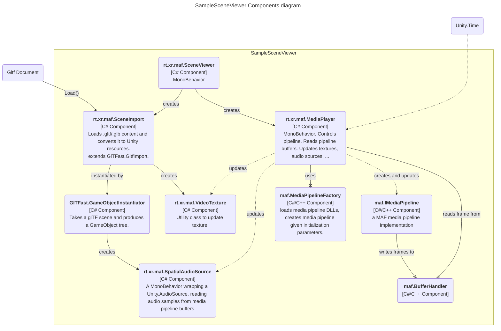

```mermaid
---
title: SampleSceneViewer Components diagram
---
flowchart TB

gltf("Gltf Document") -- "Load()" --> sceneImport

subgraph SampleSceneViewer

    audioSource("`
**rt.xr.maf.SpatialAudioSource**
[C# Component]
A MonoBehavior wrapping a Unity.AudioSource, reading audio samples from media pipeline buffers 
`")
    instantiator -- creates --> audioSource

    videoTexture("`
**rt.xr.maf.VideoTexture**
[C# Component]
Utility class to update texture.
`")
    sceneImport -- creates --> videoTexture

    sceneImport("`
**rt.xr.maf.SceneImport**
[C# Component]
Loads .gltf/.glb content and converts it to Unity resources.
extends GlTFast.GltfImport. 
`")    
    instantiator("`
**GlTFast.GameObjectInstantiator**
[C# Component]
Takes a glTF scene and produces a GameObject tree.
`")
    sceneImport -- instantiated by --> instantiator 

    mediaPipeline("`
**maf.IMediaPipeline**
[C#/C++ Component]
a MAF media pipeline implementation
`")
    mediaPipeline -- writes frames to --x bufferHandler
    bufferHandler("`
**maf.BufferHandler**
[C#/C++ Component]
`")

    mediaPlayer("`
**rt.xr.maf.MediaPlayer**
[C# Component]
MonoBehavior. Controls pipeline. Reads pipeline buffers. Updates textures, audio sources, ...
`")
    mediaPlayer -. creates and updates .-> mediaPipeline
    mediaPlayer -- reads frame from --x bufferHandler
    mediaPlayer -. updates .-> videoTexture
    mediaPlayer -. updates .-> audioSource

    factory("`
**maf.MediaPipelineFactory**
[C#/C++ Component]
loads media pipeline DLLs, creates media pipeline given initialization parameters.
`")
    mediaPlayer -- uses --x factory

    sceneViewer("`
**rt.xr.maf.SceneViewer**
[C# Component]
MonoBehavior
`")   
    sceneViewer -- creates --> sceneImport
    sceneViewer -- creates --> mediaPlayer
end

clock("Unity.Time") -..-> mediaPlayer

```