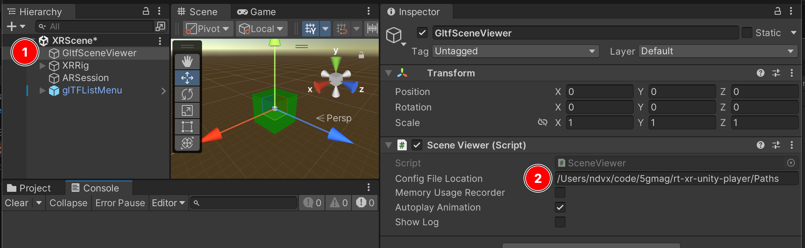

## Configuration file

`rt-xr-unity-player` expects a configuration file providing a list of gltf documents to populate the main application menu.

The configuration file is a simple text file with each line providing the URI of a gltf document. It can be modified without recompiling the player.

The URIs can point to local files or http ressources. When a relative path is used, the gltf document location is relative to the configuration file itself.


## Configuration file location

By default the application will look for this file in the platform specific. 

### Default location

**Android**

On Android, the path would typically be: `/storage/emulated/0/Android/data/com.fivegmag.rtxrplayer/files/Paths`.

It can be confirmed by [inspecting the application's log](https://docs.unity3d.com/Manual/com.unity.mobile.android-logcat.html):
.

**Unity editor**

When running the application in Unity Editor while developing, the expected location depends on the OS and Unity version:

- MacOS (Unity 2022): `~/Library/Application\ Support/fivegmag/rt-xr-player/Paths`
- Windows (Unity 2022): `%userprofile%\AppData\LocalLow\fivegmag\rt-xr-player\Paths`

For other platforms, please refer to Unit's documentation for [Application.persistenDataPath](https://docs.unity3d.com/ScriptReference/Application-persistentDataPath.html).

### Custom location

It is possible to define a custom location for the configuration file, by setting its path in Unity's Editor:



## Push gltf content and configuration file to an Android device

**1. Push gltf content to the device**

Create a directory to upload content:

```
adb shell
mkdir -p /storage/emulated/0/Android/data/com.fivegmag.rtxrplayer/files/rt-xr-content
```

Push content to the device:

```
cd ~/code/5G-MAG/rt-xr-content/

adb push ./awards /storage/emulated/0/Android/data/com.fivegmag.rtxrplayer/files/rt-xr-content/
adb push ./furnitures /storage/emulated/0/Android/data/com.fivegmag.rtxrplayer/files/rt-xr-content/
adb push ./studio_apartment /storage/emulated/0/Android/data/com.fivegmag.rtxrplayer/files/rt-xr-content/
```

**2. Create corresponding configuration file**

Create a simple file named `Paths` listing the gltf content, one document for each line:
```
rt-xr-content/awards/scene.gltf
rt-xr-content/awards/scene_plane_anchoring.gltf
rt-xr-content/furnitures/floor_anchoring.gltf
rt-xr-content/studio_apartment/studio_apartment.gltf
```

Note that file paths in this exemple are relative. These are interpreted as relative to the `Paths` configuration file.


**3. Push the `Paths` configuration file to the device:**
```
adb push ./Paths /storage/emulated/0/Android/data/com.fivegmag.rtxrplayer/files
```

The device's `/storage/emulated/0/Android/data/com.fivegmag.rtxrplayer/files` should now contain the `Paths` configuration file, as well as the `rt-xr-content` directory and the content we uploaded:
```
adb shell ls /storage/emulated/0/Android/data/com.fivegmag.rtxrplayer/files
Paths
rt-xr-content
Unity
il2cpp
```

Content pushed to this location on the android device persists until the application is uninstalled.


## Serving gltf document from an http server

Example of `Paths` configuration file to serve content of the [rt-xr-content](http://github.com/rt-xr-content) repository from an http server on a local network:

```
http://192.168.1.234/rt-xr-content/awards/scene.gltf
http://192.168.1.234/rt-xr-content/awards/scene_plane_anchoring.gltf
http://192.168.1.234/rt-xr-content/furnitures/floor_anchoring.gltf
http://192.168.1.234/rt-xr-content/studio_apartment/studio_apartment.gltf
```


