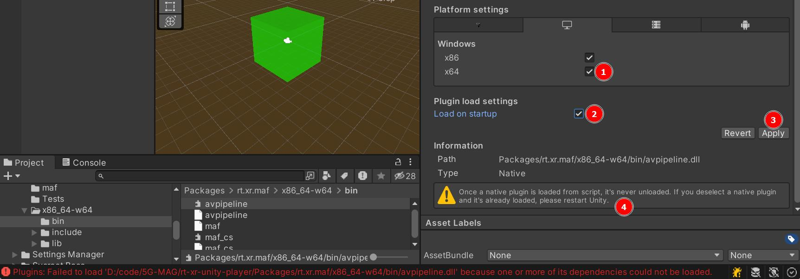

# Dependencies

[This tutorial](https://5g-mag.github.io/Getting-Started/pages/xr-media-integration-in-5g/tutorials/xr-player-overview.html) on the 5GMAG wiki provides an overview of the project's dependencies mentionned below. 

## rt-xr-gITFast : MPEG_* glTF extensions

ISO/IEC 23090-14 specifies a set of extensions to the glTF format.

These extensions are implemented in a [fork of glTFast](https://github.com/5G-MAG/rt-xr-gITFast), which has now become Unity's gltf parser.

Contributors to glTFast, must ensure to keep up to date with the fork's upstream changes.

### shader contributions

If a contribution to glTFast contains shaders, currently these shaders must be manually imported to the Unity project's directory: `rt-xr-unity-player/Assets/Resources`.

## rt-xr-maf-native : custom MediaPlayer

The XR Player uses a custom **MediaPlayer** component for decoding media.

The **MediaPlayer** component uses the **Media Access Functions (MAF) API** specified in ISO/IEC 23090-14.

The MAF API's goal is to decouple the **Presentation Engine** layer from **Media Pipeline** management, it enables the presentation engine to:

- initialize media pipelines and their buffers
- pass View informations to the media pipelines (eg. to optimize fetching media )
- read media and use buffers updated by the media pipelines

The MAF API implementation is meant to be used as a [Unity Native Plugin](https://docs.unity3d.com/Manual/NativePlugins.html). To build your own media pipelines, see the [MAF library C++ source](https://github.com/5G-MAG/rt-xr-maf-native). 

The sample media pipeline implements audio/video decoding using libav and currently supports **CPU decoding and buffers** only.

### Updating the MAF Media Pipeline factory and plugins 

When updating native plugins such as the MAF factory and its Media Pipeline plugins, **you must restart the Unity Editor**.

After restarting the project, be sure to review the DLL configuration:

1. Review the platform settings for the updated native plugin
2. **Make sure the dll is checked for load at startup**, otherwise the project will compile, but Media Pipelines will not load properly
3. Apply changes
4. Changes can not be undone without restarting the Unity editor

The same limitation applies to DLL dependencies of the Media Pipelines, such as *libav*.

